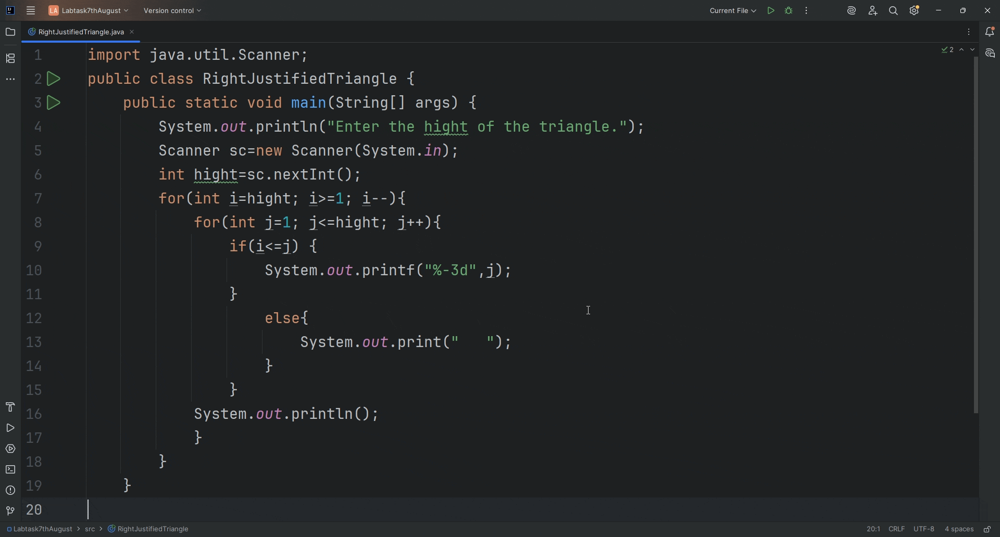

# Right Aligned Number Triangle

A simple Java console program that prints a **right-aligned triangle** of numbers.  
It takes the height as input, then prints rows of increasing numbers aligned to the right.

---

## 📜 Problem Statement

Write a program to:
1. Take the height of the triangle as input.
2. Print numbers starting from 1 in each row, increasing to the height.
3. Align the triangle so that its right edge is straight.

---

### 🎥 Demo Output



*This simple Java program prints a right aligned triangle of numbers.*
*(Numbers here are just illustrative; your actual output will follow your loop logic.)*

#### 🚀 How to Run

1. **Clone this repository**
   ```bash
   git clone https://github.com/YOUR_USERNAME/RightAlignedNumberTriangle.git
   cd RightAlignedNumberTriangle

2.Compile the Java file:

javac RightAlignedNumberTriangle.java

3.Run the program:

java RightAlignedNumberTriangle
